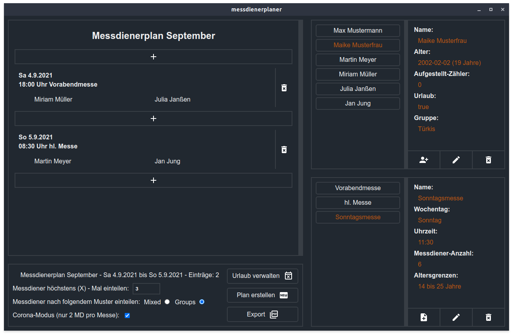

# messdienerplaner
Programm zur Verwaltung von Messdienern und dem einfachen Erstellen von Messdienerplänen.
<p align="center">

</p>

## Features
- Eingabe und Verwaltung von Messdienern
- Eingabe und Verwaltung von Messen
- Erstellen vom Messdienerplan
  - Eintragen von gespeicherten Messen und manuelle Eingabe möglich
  - Automatisches zuordnen des passenden Datums einer Messe
  - Automatisches Eintragen der Messdiener nach vorgegebenen Kriterien
    - Alter, Gruppenzugehörigkeit, Häufigkeit, Urlaub, uvm.
  - Coronamodus: nur 2 Messdiener werden pro Messe eingeteilt
- Export des Messdienerplan als PDF
  - Titelblatt mit eigenem Text und Logo/Bild
  - Numerierte Seiten
  - Kein Seitenumbruch innerhalb eines Eintrags

## Getting Started
Als erstes musst du sicherstellen, dass `Node.js` installiert ist, damit kannst du dann `node` und `npm` nutzen.

Wenn `Node.js` auf deinem System installiert ist, kannst du einfach dieses Repository klonen:

```sh
git clone https://github.com/Bj6rn/messdienerplaner.git
```

Fast geschaft, die letzen Schritte um den __messdienerplaner__ zu nutzen sind dann wie folgt:
- `cd messdienerplaner` um ins Programmverzeichnes zu gehen
- `npm install` um die Dependencies vom Programm zu installieren
- `npm start` um den __messdienerplaner__ zu starten
